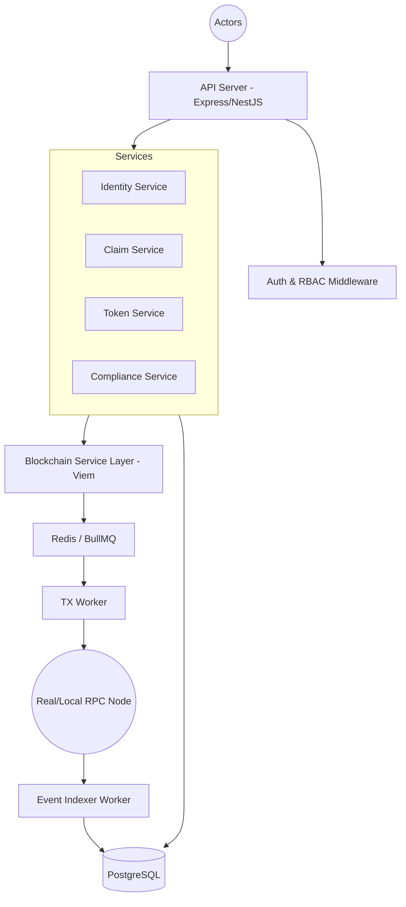

# ERC-3643 (T-REX) Backend Implementation Guide

This guide provides a production-ready blueprint for building a backend that integrates with the **ERC-3643 (T-REX)** smart contract suite.

---

## 1. SYSTEM ARCHITECTURE

The architecture follows a modular service-oriented approach to decouple API concerns from blockchain transaction management and event indexing.

### Architecture Overview


### Core Components
- **API Server**: Handles REST requests, validation, and authentication.
- **Blockchain Service Layer**: High-level abstraction for `viem`. Handles transaction encoding and gas estimation.
- **Queue System**: Essential for handling asynchronous blockchain transactions and retries without blocking API responses.
- **Event Indexer**: Background service that listens for logs (Identity, Token, Compliance) to maintain a synchronized source of truth in the DB.

---

## 2. PROJECT STRUCTURE

```bash
/src
  /modules
    /investors      # Identity registration, wallet linking
    /claims         # Issuance, revocation, topics
    /tokens         # Minting, transfers, burning
    /compliance      # Freeze/unfreeze, paused state
    /issuers        # Trusted issuer registry management
    /agents         # Role management (MINT_AGENT, etc.)
  /blockchain       # Shared viem clients, ABIs, contract addresses
  /services         # Shared cross-cutting logic
  /database         # TypeORM/Prisma entities, repositories, migrations
  /middleware       # JWT, RBAC, Error handling
  /workers          # BullMQ worker implementations (TX submitter, Indexer)
  /common           # Guards, decorators, constants
```

---

## 3. DATABASE SCHEMA

The schema bridges asynchronous blockchain state with relational queryable data.

### Core Tables
1.  **investors**: `id (UUID), primary_wallet (address), country (code), status (enum), metadata (jsonb)`.
2.  **wallets**: `address (PK), investor_id (FK), identity_address (address), is_primary (bool)`.
3.  **claims**: `id, wallet (address), topic (int/enum), claim_id (hex), issuer (address), status (active|revoked)`.
4.  **tokens**: `address (PK), name, symbol, total_supply, is_paused (bool)`.
5.  **balances**: `wallet (address), token_address (address), amount (numeric), frozen_amount (numeric)`.
6.  **transactions**: `tx_hash (PK), from, to, amount, type (mint|transfer|force), status (pending|confirmed|failed)`.
7.  **events**: `id, block_number, log_index, tx_hash, event_name, data (jsonb)`.

> [!TIP]
> Use **Indexes** on `address` and `tx_hash` fields. Use `numeric` or `string` for big numbers to avoid precision loss.

---

## 4. BLOCKCHAIN INTEGRATION (VIEM)

Abstract blockchain complexity into a dedicated `ViemBlockchainService`.

### Registration Example
```typescript
const { request } = await publicClient.simulateContract({
  address: IDENTITY_REGISTRY_ADDRESS,
  abi: IdentityRegistryABI,
  functionName: 'registerIdentity',
  args: [investorWallet, identityAddress, countryCode],
  account: issuerAddress,
});
const hash = await walletClient.writeContract(request);
```

### Transfer Simulation (Gasless Pre-flight)
```typescript
const canTransfer = await publicClient.readContract({
  address: TOKEN_ADDRESS,
  abi: TokenABI,
  functionName: 'canTransfer',
  args: [from, to, amount],
});
// If false, abort transaction before wasting gas.
```

---

## 5. API SPECIFICATION

Refer to the previously generated [API Specification](file:///Users/afo/sentit/Tokenization/tests/integration/api.test.ts) for detailed request/response shapes. 

**Key Logic Rule:** Every "Write" endpoint (Mint, Transfer, Freeze) should ideally return a `jobId` from the queue immediately, while "Read" endpoints (Balance, Portfolio) query the indexed Database.

---

## 6. COMPLIANCE WORKFLOW

ERC-3643 enforces compliance via the `ModularCompliance` and `IdentityRegistry` contracts.

1.  **Identity Check**: `identityRegistry.contains(wallet)`
2.  **Claim Validation**: `identityRegistry.getIdentity(wallet).getClaim(topic)`
3.  **Global Restrictions**: Check `token.paused()` and `token.isFrozen(wallet)`.
4.  **simulation**: Always call `token.canTransfer()` in your backend simulation before submitting.

---

## 7. EVENT INDEXING SYSTEM

The Indexer ensures your UI shows real-time updates without polling the RPC for every list view.

1.  **Fetch**: Loop from `last_processed_block` to `latest`.
2.  **Process**: For each `Transfer(from, to, value)`, update the `balances` table.
3.  **Idempotency**: Use `tx_hash + log_index` as a unique constraint to prevent duplicate processing if a block is re-indexed.

---

## 8. SECURITY & PERMISSIONS

Implement **Role-Based Access Control (RBAC)**:
- **Issuer**: Controls deployment and global system settings.
- **Agent**: Authorized for daily operations like `mint`.
- **Compliance Officer**: Authorized for `freeze` and `claim topic` updates.
- **Investor**: Only authorized for `transfer` of their own holdings.

---

## 9. ERROR HANDLING

- **Transaction Reverts**: Parse `canTransfer` reason codes (e.g., `01` = Identity missing).
- **Nonce Conflicts**: Use a Redis-based nonce manager if using multiple workers.
- **RPC Stability**: Implement a provider rotator or retry with exponential backoff.
- **Queue Retries**: Use BullMQ with 3-5 retries for temporary network issues.

---

## 10. TESTING STRATEGY

- **Unit Tests**: Mock `viem` to test business logic and controllers.
- **Integration Tests**: Test API endpoints using **Supertest**.
- **E2E Workflows**: Use **Hardhat** to simulate the full lifecycle (Onboarding → Issuance → Transfer → Regulatory Action).

---

## 11. IMPLEMENTATION ROADMAP

1.  **Infrastructure**: Setup NestJS/Express, DB, and Redis.
2.  **Blockchain Layer**: Configure Viem clients and load ABIs.
3.  **Identity Module**: Implement registration and claim issuance.
4.  **Token Module**: Implement minting logic.
5.  **Compliance Layer**: Implement pre-flight simulations.
6.  **Indexer**: Build the background worker for event capture.
7.  **Admin UI/API**: Finalize regulatory controls (freeze, forced transfer).
8.  **E2E Verification**: Pass all 13 workflow tests.
